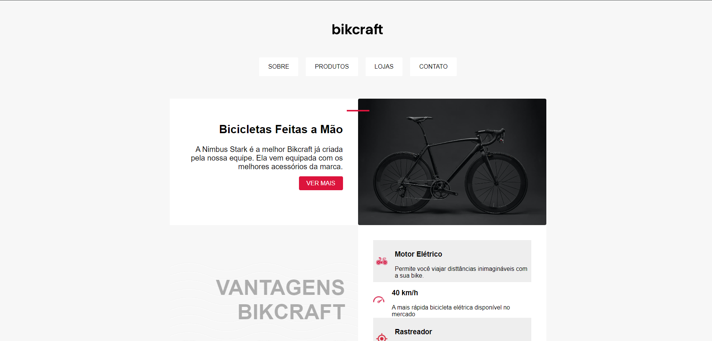
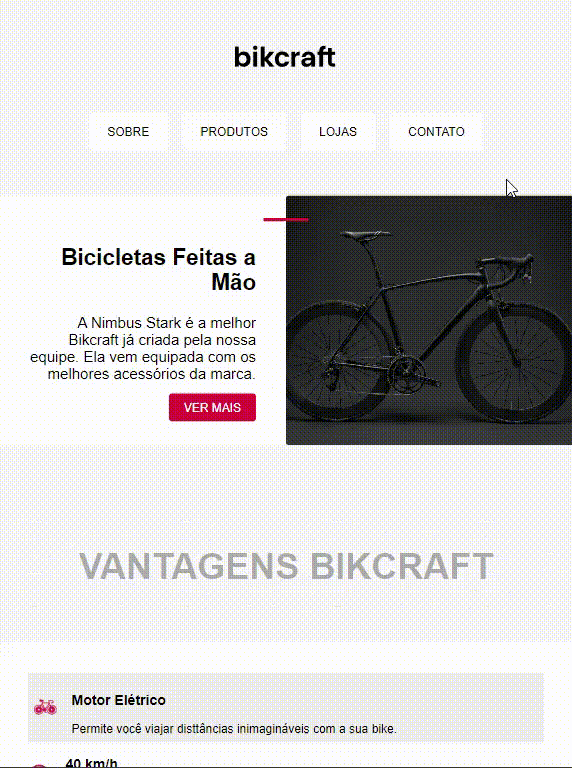
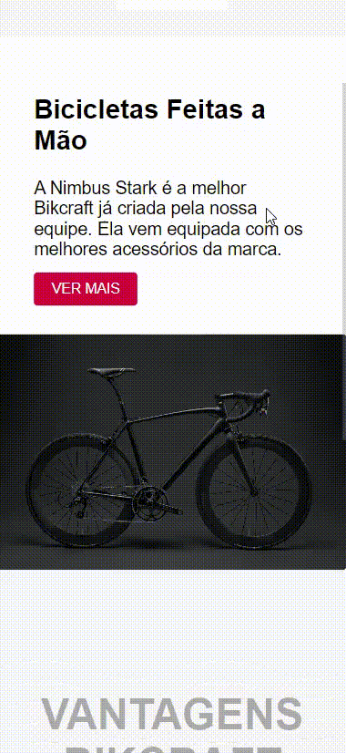

# Site BIKCRAFT

### Abrir e rodar o projeto:

https://leandrocamilo09.github.io/SITE-_-BIKCRAFT/

## "Status atual do projeto:

- Em andamento.

## Objetivo Pessoal:

Com este projeto, o objetivo é dar o primeiro passo na programação, despertando o interesse pelas linguagens de codificação e estilização. Vale mencionar que este é o meu primeiro projeto, o que o torna também um exercício de curiosidade.

## Sobre o Projeto:

O projeto é uma loja de bicicletas online, inicialmente consistindo em uma única página que apresenta um produto, sua descrição e características.

## Dispositivos:

O projeto tem resposividade para qualquer tipo de tela. 

|            Tablete            |            Celular             |
| :---------------------------: | :----------------------------: |
|  |  |

## Equipe:

- `Leandro Camilo`

## Tecnologias utilizadas:

- `JavaScript`
- `HTML`
- `Css`
